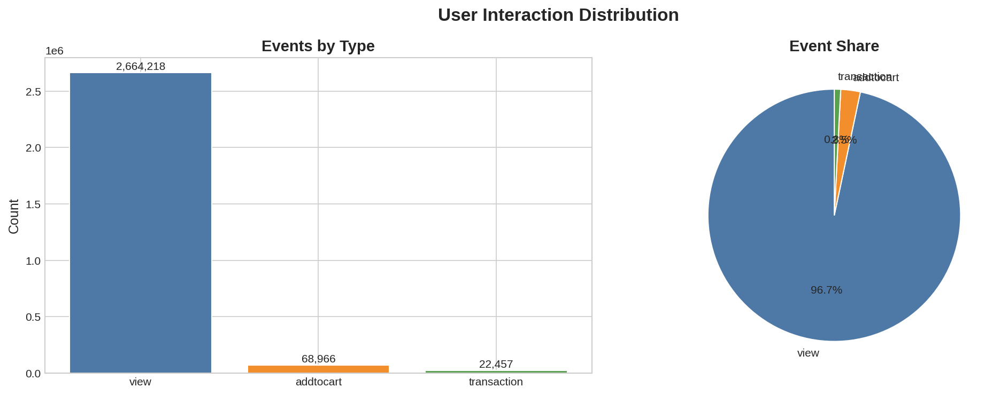

# Retailrocket Recommender System

<div align="center">
  
  <p><em>Interactive Product Recommendation System for E-Commerce</em></p>
</div>

## 📋 Overview

This project implements a comprehensive **Product Recommendation System** for e-commerce platforms using the Retailrocket clickstream dataset. The system analyzes user behavior patterns and provides personalized product recommendations through multiple algorithms, with a focus on handling real-world challenges like data sparsity and cold-start problems.

**Live Demo:** [https://missmisoo-recommendersystem.streamlit.app/](https://missmisoo-recommendersystem.streamlit.app/)

### 🎯 Key Features

- **Multiple Recommendation Algorithms**: Popularity baseline, Item-based CF, User-based CF, Matrix Factorization (SVD), Session-based, and Hybrid ensemble
- **Real-time Recommendations**: Session-aware recommendations with recency weighting
- **Cold-start Handling**: Intelligent fallback strategies for new users and items
- **Interactive Dashboard**: Streamlit-based web interface for testing and visualization
- **Comprehensive Evaluation**: Precision@K, Recall@K, and MAP@K metrics
- **Business Insights**: Actionable recommendations for e-commerce optimization

## 📊 Dataset

The project uses the [Retailrocket Recommender Dataset](https://www.kaggle.com/datasets/retailrocket/ecommerce-dataset) from Kaggle, which contains:

| File | Description | Size |
|------|-------------|------|
| `events.csv` | User interactions (views, cart adds, purchases) | 2.76M rows |
| `item_properties_part1.csv` | Product attributes (Part 1) | 20.2M rows |
| `item_properties_part2.csv` | Product attributes (Part 2) | 20.2M rows |
| `category_tree.csv` | Product category hierarchy | 1,669 rows |

### Dataset Statistics

| Metric | Value |
|--------|-------|
| **Total Events** | 2,755,641 |
| **Unique Users** | 1,407,580 |
| **Unique Products** | 235,061 |
| **Total Sessions** | 1,761,675 |
| **Time Span** | 137 days |
| **Views** | 2,664,218 (96.7%) |
| **Cart Adds** | 68,966 (2.5%) |
| **Purchases** | 22,457 (0.8%) |
| **Data Sparsity** | 99.9994% |

### Event Types

- **View** (weight: 1) - User looked at a product (weak signal)
- **AddToCart** (weight: 3) - User added to cart (medium signal)
- **Transaction** (weight: 5) - User purchased product (strong signal)

## 🏗️ Project Structure

```
Retailrocket-Recommender-System/
│
├── 📁 data/
│   ├── 📁 raw/                  # Original dataset files
│   │   ├── events.csv
│   │   ├── item_properties_part1.csv
│   │   ├── item_properties_part2.csv
│   │   └── category_tree.csv
│   └── 📁 processed/             # Cleaned and processed data
│       ├── processed_events.parquet
│       ├── user_item_matrix.csv
│       ├── item_metadata.csv
│       ├── co_occurrence.csv
│       ├── item_transitions.pkl
│       └── item_frequencies.pkl
│
├── 📁 models/                    # Trained models
│   ├── model_pipeline.pkl        # Complete model pipeline
│   ├── item_popularity.csv        # Popularity scores
│   └── comparision_results.csv    # Model comparison results
│
├── 📁 notebooks/                  # Jupyter notebooks
│   ├── 01_Data_Preparation_and_EDA.ipynb
│   └── 02_Modeling.ipynb
│
├── 📁 output/                     # Output files
│   ├── 📁 figures/                # Generated visualizations
│   └── 📁 evaluation_results/      # Evaluation metrics
│
├── app.py                         # Streamlit web application
├── requirements.txt                # Python dependencies
├── runtime.txt                     # Python version specification
├── README.md                       # Project documentation
└── .gitattributes                  # Git configuration
```

## 🚀 Installation & Setup

### Prerequisites

- Python 3.9 or higher
- pip package manager
- Git (optional)

### Step 1: Clone the Repository

```bash
git clone https://github.com/yourusername/Retailrocket-Recommender-System.git
cd Retailrocket-Recommender-System
```

### Step 2: Install Dependencies

```bash
pip install -r requirements.txt
```

The `requirements.txt` file includes:

```
streamlit==1.28.0
pandas==2.0.3
numpy==1.24.3
scikit-learn==1.3.0
matplotlib==3.7.2
seaborn==0.12.2
plotly==5.15.0
tqdm==4.65.0
```

### Step 3: Download the Dataset

Download the Retailrocket dataset from [Kaggle](https://www.kaggle.com/datasets/retailrocket/ecommerce-dataset) and place the files in the `data/raw/` directory:

```bash
data/raw/
├── events.csv
├── item_properties_part1.csv
├── item_properties_part2.csv
└── category_tree.csv
```

### Step 4: Run the Notebooks

Execute the notebooks in order:

1. **Data Preparation & EDA** (`notebooks/01_Data_Preparation_and_EDA.ipynb`)
   - Loads and cleans the data
   - Creates session IDs and interaction weights
   - Generates user-item matrices
   - Performs exploratory analysis
   - Saves processed artifacts

2. **Model Development** (`notebooks/02_Modeling.ipynb`)
   - Loads processed data
   - Trains 6 recommendation models
   - Evaluates using Precision@K, Recall@K, MAP@K
   - Compares model performance
   - Saves best model pipeline

### Step 5: Launch the Streamlit App

```bash
streamlit run app.py
```

The app will open in your browser at `http://localhost:8501`.

## 🧠 Recommendation Algorithms

### 1. Popularity Baseline
Recommends the most popular items to all users. Simple but establishes a performance benchmark.

### 2. Item-Based Collaborative Filtering
Finds items similar to those a user has interacted with using Jaccard similarity based on co-occurrence in sessions.

### 3. User-Based Collaborative Filtering
Finds users with similar interaction patterns and recommends items they liked.

### 4. Matrix Factorization (TruncatedSVD)
Decomposes the user-item matrix into latent factors to capture hidden patterns in sparse data.

### 5. Session-Based Recommender
Uses sequential patterns within sessions with recency weighting to provide real-time recommendations.

### 6. Hybrid Ensemble
Combines all strategies with dynamic weighting based on user history length.

## 📈 Performance Evaluation

Models were evaluated using leave-last-out validation with the following metrics at K=10:

| Model | Precision@10 | Recall@10 | MAP@10 | vs Baseline |
|-------|--------------|-----------|--------|-------------|
| Popularity | 0.01109 | 0.01124 | 0.01109 | baseline |
| Item-CF | 0.01174 | 0.01189 | 0.01174 | +5.9% |
| User-CF | 0.00892 | 0.00923 | 0.00892 | -19.6% |
| SVD | 0.01086 | 0.01101 | 0.01086 | -2.1% |
| **Session** | **0.01350** | **0.01372** | **0.01350** | **+21.6%** |
| Hybrid | 0.01293 | 0.01308 | 0.01293 | +16.6% |

### Key Findings

- **Session-based model** achieves the best performance (+21.6% over baseline)
- **User-based CF** struggles due to extreme data sparsity
- **Cold-start is the norm**: 71.2% of users have only 1 event
- **Long tail distribution**: 78.3% of products have ≤10 interactions

## 💡 Business Insights

### 1. Session-First Architecture Wins
The session-based model outperforms others because most users have limited history. Real-time context provides stronger signal than sparse past interactions.

### 2. Cold-Start is the Default State
With 71% of users having only 1 event, the system must be designed for cold-start from the ground up.

### 3. Category Information Matters
Products in the same category are much more likely to co-occur in sessions, providing valuable signal for new items.

### 4. Hybrid Approach is Most Robust
No single algorithm works best for all user types. A hybrid that adapts to user history length provides the best overall experience.

## 🎯 Business Recommendations

| Strategy | Expected Impact | Implementation |
|----------|-----------------|----------------|
| **Session-based recommendations on product pages** | +15-20% CTR | Show "People also viewed" based on current session |
| **Frequently bought together** | +8-12% AOV | Use item co-occurrence patterns |
| **Cart abandonment retargeting** | +20-25% recovery | Personalized recommendations via email |
| **New user onboarding** | Better cold-start | Ask users to select 3-5 category preferences |
| **Real-time personalization** | Increased engagement | Update recommendations after each click |

## 🖥️ Web Application

The Streamlit app provides an interactive interface with four main sections:

### 🏠 Home
- Overview of the project and dataset statistics
- Quick start guide
- Display of most popular items

### 🎯 Recommendations
- User ID input for personalized recommendations
- Model selection (Popularity, Item-CF, Session, Hybrid, Compare All)
- Adjustable number of recommendations (5-20)
- Download results as CSV

### 📊 Analysis
- Key statistics and metrics
- Visualizations of product popularity
- Long tail distribution analysis
- Model performance comparison charts
- Business insights

### ℹ️ About
- Project documentation
- Dataset information
- Model descriptions
- Performance summary
- Developer information

## 🔧 Troubleshooting

### Common Issues and Solutions

1. **Models not loading**
   - Ensure `models/model_pipeline.pkl` and `models/item_popularity.csv` exist
   - Run Notebook 2 to generate the models

2. **Memory errors**
   - The dataset is large; use the sample size options in evaluation
   - Consider using a machine with at least 8GB RAM

3. **Streamlit app not running**
   - Verify all dependencies are installed: `pip install -r requirements.txt`
   - Check Python version: `python --version` (should be 3.9+)

4. **Missing data files**
   - Download the dataset from Kaggle
   - Place files in `data/raw/` directory

## 📚 References

- [Retailrocket Dataset on Kaggle](https://www.kaggle.com/datasets/retailrocket/ecommerce-dataset)
- [Streamlit Documentation](https://docs.streamlit.io/)
- [Scikit-learn User Guide](https://scikit-learn.org/stable/user_guide.html)
- [Collaborative Filtering Explained](https://developers.google.com/machine-learning/recommendation)

## 📄 License

This project is licensed under the MIT License - see the [LICENSE](LICENSE) file for details.

## 👨‍💻 Author

**Sabin Lamsal**  
Machine Learning Intern  
Miss Misoo Production  
March 2026

## 🙏 Acknowledgments

- Miss Misoo Production for the internship opportunity
- Retailrocket for providing the dataset
- Kaggle for hosting the dataset

## 📬 Contact

For questions or feedback, please open an issue on GitHub or contact the author through the [live demo](https://missmisoo-recommendersystem.streamlit.app/).

---

<div align="center">
  <p>Made with ❤️ for Miss Misoo Production</p>
  <p>© 2026 Miss Misoo Production. All rights reserved.</p>
</div>
